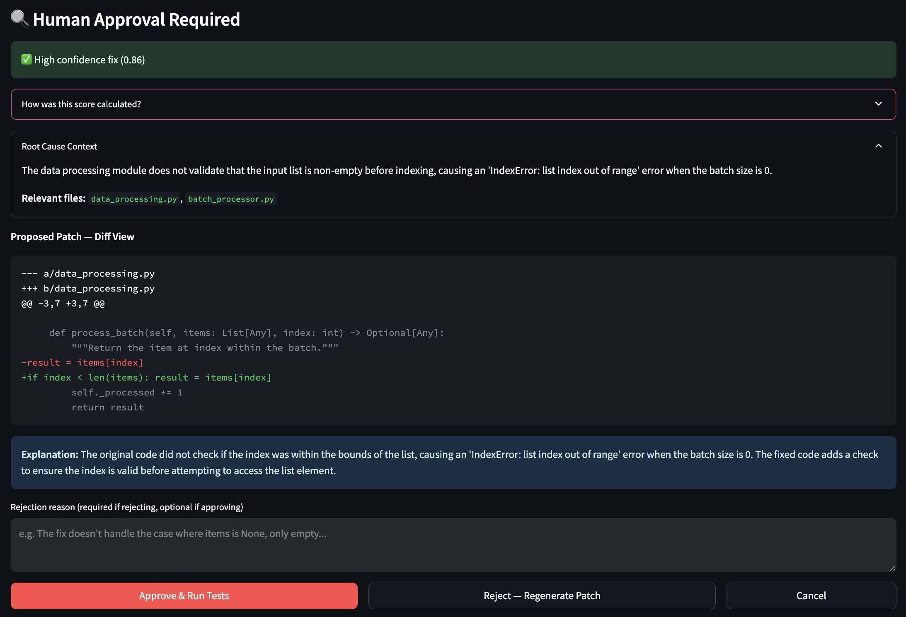
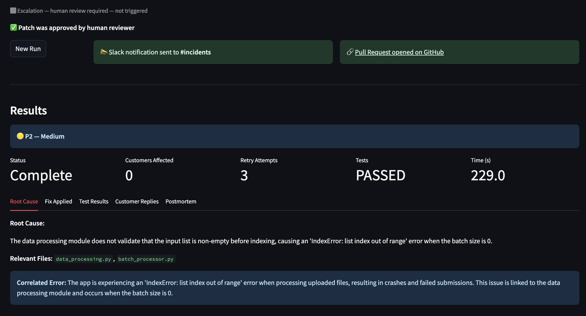
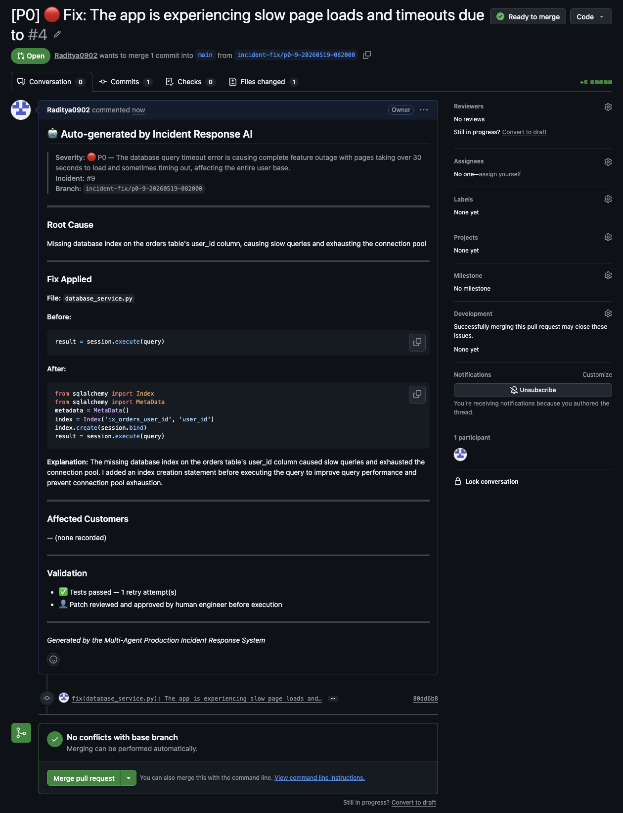
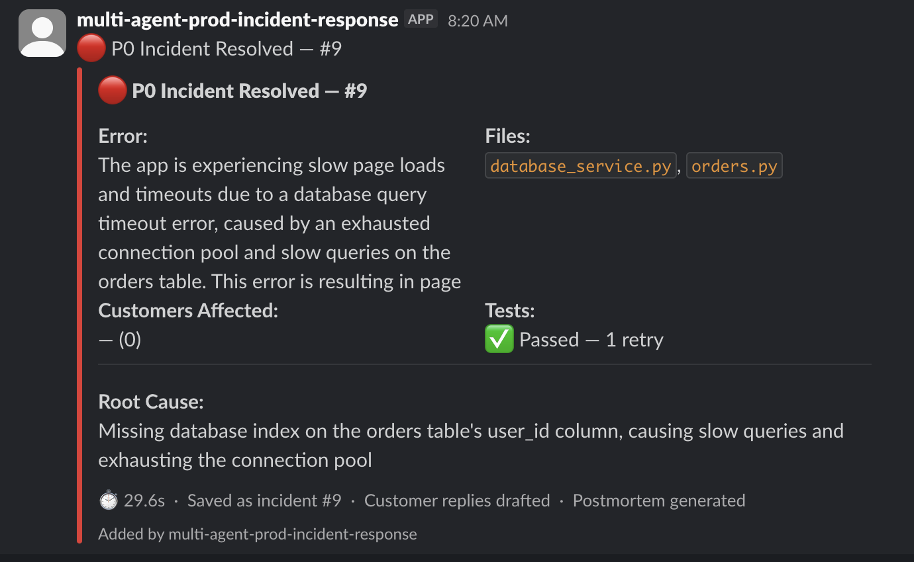
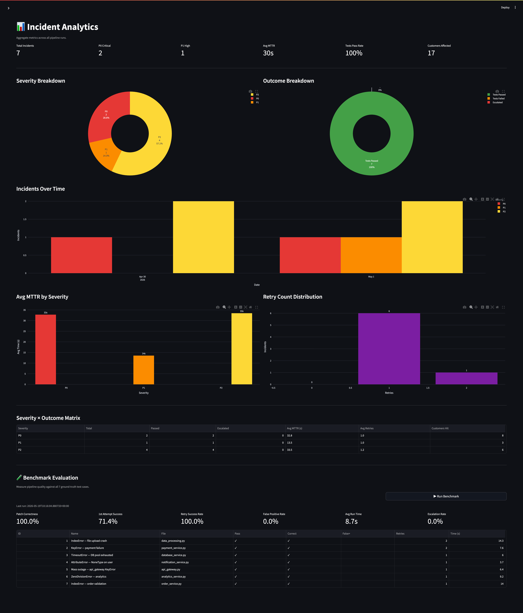
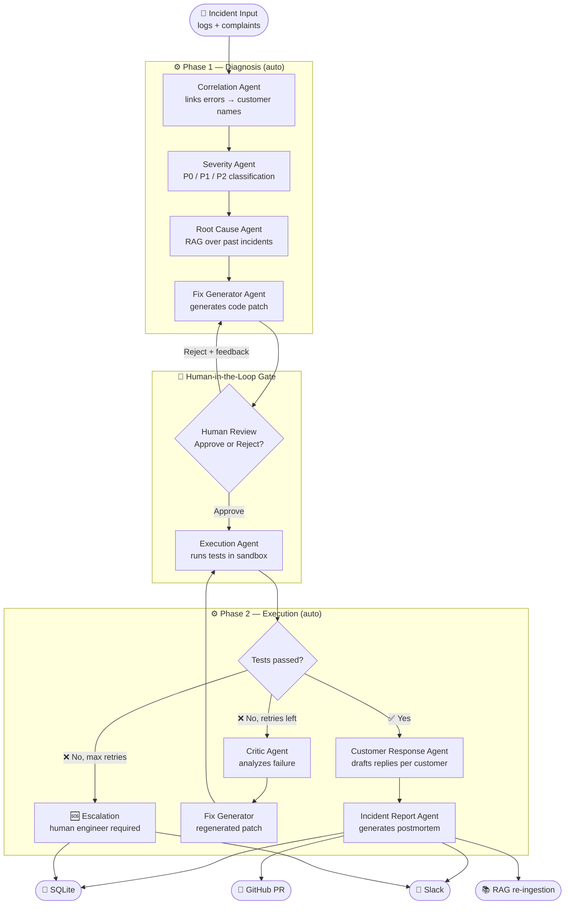
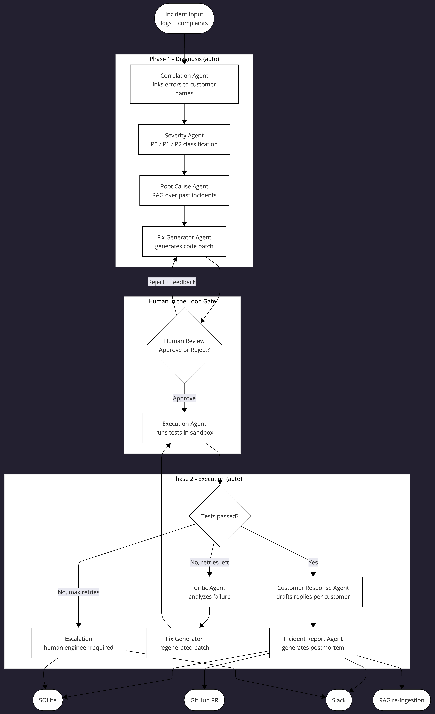
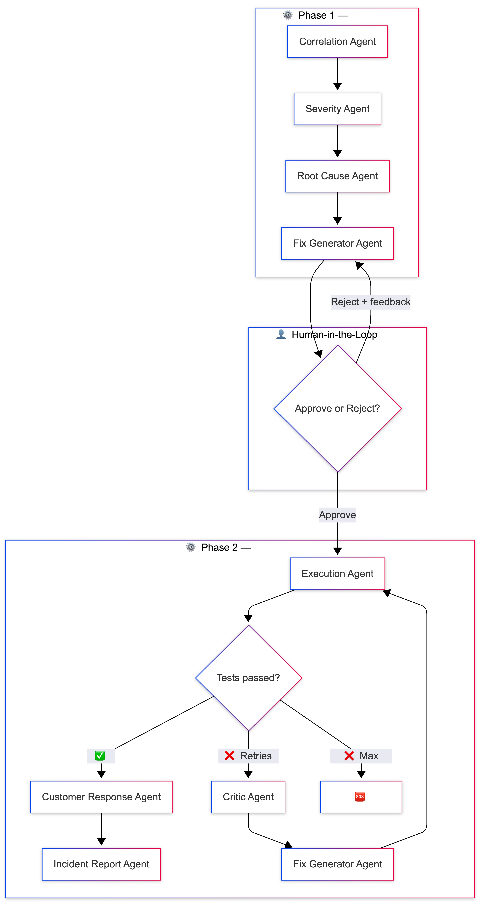

# Multi-Agent Production Incident Response System

A fully autonomous AI pipeline that handles production software incidents end-to-end. Paste error logs and customer complaints into the dashboard, click **Run**, and within ~90 seconds the system has diagnosed the root cause, written and tested a code fix, drafted personalized customer replies, sent a Slack notification, and opened a GitHub PR — with a human approval gate before any code is touched.

Built with **LangGraph**, **Groq (Llama 3)**, **ChromaDB RAG**, **Streamlit**, **Slack**, and **GitHub API**.

---

## Why This Project Exists

Production incidents require a coordinated sequence of actions that are easy to get wrong under pressure: correlating error logs with customer reports, classifying severity, diagnosing root cause, writing a targeted fix, running tests, notifying stakeholders, and producing a postmortem. Done manually, each step takes minutes; together they can stretch to hours.

This project tests whether a multi-agent AI system can safely complete the full incident-response loop — with a human approval gate before any code is executed — in under two minutes on realistic scenarios.

The design prioritizes **correctness over speed**: every code change requires explicit human review and a passing test suite before it is committed. Automation handles the toil; humans retain control of the decision.

---

## Demo

### HITL Approval Gate


### Tests Passing in Sandbox


### Auto-Generated GitHub PR


### Slack Notification


### Analytics Dashboard


| Artifact | Link |
|---|---|
| Benchmark results | [`docs/benchmark-results.md`](docs/benchmark-results.md) |
| Sample run trace | [`docs/sample-run-trace.md`](docs/sample-run-trace.md) |
| Sample generated PR | [`docs/sample-generated-pr.md`](docs/sample-generated-pr.md) |
| Demo walkthrough script | [`docs/demo.md`](docs/demo.md) |
| Limitations & failure modes | [`docs/limitations.md`](docs/limitations.md) |

---

## Pipeline Architecture





### How data flows through the system

**Phase 1 — Diagnosis** runs automatically when you click Run.

1. **Correlation Agent** parses the raw logs and complaint text into a clean `correlated_error` string (e.g. `"IndexError in data_processing.py:42"`) and extracts affected customer names. This structured summary is what every downstream agent works from — not the raw text.

2. **Severity Agent** reads the correlated error, customer count, and keywords (payment, outage, crash, etc.) to assign a P0 / P1 / P2 label with a one-line reason. The label appears as a colored badge throughout the UI.

3. **Root Cause Agent** queries ChromaDB with the correlated error and retrieves the top-3 semantically similar past incidents. It feeds those as context to the LLM alongside the current logs, producing a structured root cause explanation and a list of relevant source files. It also records the cosine distance of the top match as `rag_similarity_score`, which feeds into the confidence score at the approval gate.

4. **Fix Generator Agent** takes the root cause analysis and relevant files and produces a code patch in a delimited format (`===FILE=== / ===ORIGINAL=== / ===FIXED===`). This avoids JSON escaping issues with code. The prompt includes explicit guard-pattern rules (bounds checks, `.get()` calls, `None` guards, zero-division guards) to keep patches minimal and surgical.

**Human-in-the-Loop Gate** pauses the pipeline. You see:
- A colored severity badge and confidence score (0.0–1.0) built from three signals: RAG similarity, attempt count, and patch scope.
- A **unified diff view** of the proposed change with surrounding source context.
- An Approve button (proceeds) or a Reject input (requires written feedback, which becomes `critic_feedback` for the next attempt).

**Phase 2 — Execution** runs automatically after approval.

5. **Execution Agent** first searches the real repository for a matching pytest file (e.g. `tests/test_data_processing.py`). If found, it patches the actual source file in a sandbox and runs the real tests. If not, it falls back to a synthetic harness. A `used_real_tests` flag is stored in state and shown as a banner in the UI.

6. **Critic Agent** (retry path only) reads the failed test output and the patch, and produces structured feedback in a `WHAT FAILED / WHY / NEXT ATTEMPT MUST` format. This feedback is injected into the Fix Generator on the next attempt.

7. **Customer Response Agent** batches all affected customers into a single LLM call using `---CUSTOMER: name---` delimiters, producing a personalized reply for each.

8. **Incident Report Agent** generates a Markdown postmortem. Factual sections (timeline, root cause, fix) are template-filled from state; only recommendations use the LLM.

**Side effects** on success:
- Incident saved to SQLite with full state
- Slack Block Kit message sent to `#incidents`
- GitHub PR opened with the patch applied to the real source file
- Postmortem document automatically ingested back into ChromaDB — so the system learns from every resolved incident

---

### Two-Phase LangGraph Split

The pipeline is compiled into two separate `StateGraph` objects to support the human gate without requiring a persistent checkpointer:

| Phase | Agents | Trigger |
|---|---|---|
| **Phase 1** | Correlation → Severity → Root Cause → Fix Generator | "Run" button |
| **Phase 2** | Execution → [Critic → Fix Generator loop] → Customer Response → Incident Report | "Approve" button |

Rejection at the gate calls `fix_generator_agent()` directly (no graph re-run) and stays on the approval screen with the updated patch.

> For a worked example trace through the full pipeline, see [`docs/sample-run-trace.md`](docs/sample-run-trace.md).
> For benchmark methodology and full results, see [`docs/benchmark-results.md`](docs/benchmark-results.md).

---

## Features

- **7 specialized AI agents** orchestrated by LangGraph with a conditional retry loop
- **RAG retrieval** via ChromaDB + sentence-transformers — past incidents inform the diagnosis
- **RAG auto-feedback loop** — every resolved incident is ingested back as a new postmortem document
- **Confidence score** (0.0–1.0) at the approval gate: RAG similarity + attempt count + patch scope
- **Unified diff view** — side-by-side before/after with surrounding source context at the approval gate
- **Severity classification** (P0/P1/P2) with reasoning, shown as colored badges throughout the UI
- **Human-in-the-loop patch approval** — review and optionally reject with feedback before execution
- **Self-healing retry loop** — Critic Agent analyzes test failures and guides regeneration (up to 3 attempts)
- **Real test file discovery** — Execution Agent uses your actual pytest files when available
- **Isolated test execution** — patches run in a subprocess sandbox (Docker optional)
- **Personalized customer replies** — all customers batched into one LLM call
- **Slack notifications** — rich Block Kit messages with severity color, root cause, customers, and PR link
- **GitHub PR creation** — branch, commit, and PR opened automatically on test pass
- **SQLite incident history** — browse, filter by severity, and download postmortems
- **Analytics dashboard** — severity breakdown, MTTR trends, retry distribution, outcome matrix
- **Benchmark suite** — run all 7 test cases and track patch correctness, false positive rate, and run time
- **Webhook API** (FastAPI) — external tools can POST incidents directly on port 8000
- **Dry run mode** — `?dry_run=true` runs the full pipeline without saving, notifying, or opening a PR
- **Fallback LLM** — automatically switches to Gemini/OpenAI/Anthropic when Groq daily quota is exhausted
- **Streaming output** — root cause and fix explanation stream character-by-character as agents complete
- **Rate limit handling** — exponential backoff (2s → 4s → 8s → 16s) for per-minute Groq limits
- **Docker support** — `docker compose up --build` starts everything with persistent volumes

---

## Tech Stack

| Layer | Technology |
|---|---|
| Agent orchestration | [LangGraph](https://github.com/langchain-ai/langgraph) |
| LLM | [Groq API](https://console.groq.com/) — `llama-3.3-70b-versatile` (or `llama-3.1-8b-instant`) |
| RAG vector store | [ChromaDB](https://www.trychroma.com/) + `sentence-transformers/all-MiniLM-L6-v2` |
| Frontend | [Streamlit](https://streamlit.io/) |
| Webhook API | [FastAPI](https://fastapi.tiangolo.com/) + [Uvicorn](https://www.uvicorn.org/) |
| Notifications | [slack-sdk](https://slack.dev/python-slack-sdk/) |
| GitHub integration | [PyGithub](https://pygithub.readthedocs.io/) |
| Analytics charts | [Plotly](https://plotly.com/python/) |
| Persistence | SQLite (stdlib `sqlite3`) |
| Testing | [pytest](https://pytest.org/) |
| Containerization | Docker + Docker Compose |

---

## Project Structure

```
├── agents/                   # One file per agent
│   ├── __init__.py           # Lazy LLM singleton, exponential backoff, fallback LLM switcher
│   ├── state.py              # IncidentState TypedDict + create_initial_state()
│   ├── correlation_agent.py  # Extracts error summary and customer names from logs
│   ├── severity_agent.py     # Classifies P0 / P1 / P2 with reasoning
│   ├── root_cause_agent.py   # RAG-augmented root cause diagnosis; records rag_similarity_score
│   ├── fix_generator_agent.py# Generates code patches in delimited format
│   ├── execution_agent.py    # Real test discovery + subprocess/Docker sandbox runner
│   ├── critic_agent.py       # Analyzes test failures and guides next attempt
│   ├── customer_response_agent.py  # Drafts personalized replies (batched)
│   └── incident_report_agent.py    # Generates Markdown postmortem
│
├── graph/
│   └── workflow.py           # LangGraph graphs: phase1_app, phase2_app, app
│
├── rag/
│   ├── vectorstore.py        # ChromaDB wrapper — retrieve_context(), retrieve_context_with_scores()
│   ├── ingestion.py          # Ingest past_incidents/*.md (+ real/ subdir) into ChromaDB
│   ├── past_incidents/       # Markdown knowledge-base files (synthetic + real/)
│   └── scripts/
│       └── fetch_real_postmortems.py  # Fetch real postmortems from danluu/post-mortems
│
├── app/                      # Buggy sample source files (one per test case)
│   ├── data_processing.py    # IndexError at line 42
│   ├── payment_service.py    # KeyError at line 87
│   ├── api_gateway.py        # KeyError at line 23
│   ├── notification_service.py  # AttributeError at line 78
│   ├── order_service.py      # IndexError at line 55
│   ├── analytics_service.py  # ZeroDivisionError at line 91
│   └── database_service.py   # TimeoutError at line 134
│
├── db/
│   └── history.py            # SQLite CRUD — save, list, get, delete, analytics, export_as_postmortem_doc
│
├── notifications/
│   ├── slack.py              # Block Kit Slack messages (bot token or webhook URL)
│   └── github_pr.py          # Branch, commit, and PR creation via PyGithub
│
├── api/
│   └── webhook.py            # FastAPI webhook — POST /webhook/incident[?dry_run=true]
│
├── frontend/
│   ├── app.py                # Main Streamlit app (5-phase HITL state machine)
│   └── pages/
│       ├── 1_History.py      # Incident history with severity filter
│       └── 2_Analytics.py    # Charts + Benchmark tab
│
├── tests/
│   ├── conftest.py           # sys.path fixture
│   ├── test_agents.py        # Patch parser, router logic, RAG, execution sandbox
│   ├── test_history.py       # SQLite CRUD tests with temp DB isolation
│   ├── test_slack.py         # Block builder and transport layer tests
│   ├── test_github_pr.py     # Branch naming, patch application, PR body tests
│   └── benchmark/
│       ├── ground_truth.py   # Expected fix patterns per source file
│       └── run_benchmark.py  # End-to-end evaluation runner; saves latest.json
│
├── sandbox/
│   └── Dockerfile            # Isolated container for code execution
│
├── data/
│   ├── sample_logs/          # indexerror_log.txt, keyerror_log.txt, timeout_log.txt
│   └── sample_complaints/    # complaints.json
│
├── Dockerfile                # App image (python:3.11-slim, CPU torch)
├── docker-compose.yml        # Streamlit (8501) + FastAPI webhook (8000)
├── entrypoint.sh             # RAG ingestion → Streamlit start
├── requirements.txt
├── .env.example              # All environment variable documentation
└── test_cases.txt            # 7 copy-paste test scenarios for the dashboard
```

---

## Quick Start (Local)

### Prerequisites

- Python 3.11+
- [Groq API key](https://console.groq.com/) (free tier available)

### 1. Clone and install

```bash
git clone https://github.com/Raditya0902/multi-agent-production-incident-response-system.git
cd multi-agent-production-incident-response-system
pip install -r requirements.txt
```

### 2. Configure environment

```bash
cp .env.example .env
# Open .env and set GROQ_API_KEY (required)
# All other variables are optional — see Environment Variables below
```

### 3. Ingest past incidents into ChromaDB

```bash
python -m rag.ingestion
# Output: "Ingested 4 synthetic + 0 real documents (4 total)"
```

### 4. Run the dashboard

```bash
streamlit run frontend/app.py
# Opens at http://localhost:8501
```

### 5. (Optional) Run the webhook API

```bash
uvicorn api.webhook:app --port 8000 --reload
# API docs at http://localhost:8000/docs
```

---

## Docker

Starts the Streamlit dashboard on **port 8501** and the FastAPI webhook on **port 8000**. ChromaDB and SQLite data persist across restarts in named Docker volumes.

```bash
docker compose up --build   # build and start everything
docker compose down         # stop
docker compose down -v      # stop and remove volumes (clears incident history and RAG)
```

The entrypoint automatically runs `rag.ingestion` before starting Streamlit, so the RAG knowledge base is always populated.

---

## Environment Variables

Copy `.env.example` to `.env` and fill in the values you need.

| Variable | Required | Default | Description |
|---|---|---|---|
| `GROQ_API_KEY` | ✅ Yes | — | Groq API key from [console.groq.com](https://console.groq.com/) |
| `LLM_MODEL` | No | `llama-3.3-70b-versatile` | Groq model. Use `llama-3.1-8b-instant` for higher rate limits |
| `GROQ_TEMPERATURE` | No | `0.2` | LLM temperature (0–1) |
| `GROQ_MAX_TOKENS` | No | `4096` | Max tokens per LLM call |
| `MAX_RETRY_ATTEMPTS` | No | `3` | Max fix retries before escalation. Set to `1` for fast demos |
| `SANDBOX_MODE` | No | `subprocess` | `subprocess` or `docker` for test execution |
| `INCIDENT_DB_PATH` | No | `./incidents.db` | SQLite database path |
| `CHROMA_PERSIST_DIR` | No | `./rag/chroma_db` | ChromaDB persistence directory |
| `SLACK_BOT_TOKEN` | No | — | Slack bot token (`xoxb-...`). Needs `chat:write` scope |
| `SLACK_WEBHOOK_URL` | No | — | Slack incoming webhook URL (alternative to bot token) |
| `SLACK_INCIDENT_CHANNEL` | No | `#incidents` | Channel for resolved incident notifications |
| `SLACK_ESCALATION_CHANNEL` | No | Same as above | Channel for escalation alerts |
| `GITHUB_TOKEN` | No | — | GitHub PAT with `repo` scope |
| `GITHUB_REPO` | No | — | Target repo in `owner/name` format |
| `GITHUB_BASE_BRANCH` | No | `main` | Branch the PR targets |
| `WEBHOOK_API_KEY` | No | — | API key for the webhook endpoint. Empty = no auth (dev mode) |
| `FALLBACK_LLM_PROVIDER` | No | — | `gemini`, `openai`, or `anthropic` — activated automatically on Groq quota exhaustion |
| `GOOGLE_API_KEY` | No | — | Required when `FALLBACK_LLM_PROVIDER=gemini` |
| `OPENAI_API_KEY` | No | — | Required when `FALLBACK_LLM_PROVIDER=openai` |
| `ANTHROPIC_API_KEY` | No | — | Required when `FALLBACK_LLM_PROVIDER=anthropic` |

---

## Running Tests

```bash
# Unit tests (no API key needed — ~8 seconds)
pytest tests/ -m "not integration" -v

# Integration test (requires GROQ_API_KEY, runs full pipeline)
pytest tests/ -m integration -v
```

Unit tests cover:
- Patch parser, router logic, execution sandbox (`test_agents.py`)
- SQLite CRUD with temp DB isolation (`test_history.py`)
- Slack Block Kit builders and transport layer (`test_slack.py`)
- GitHub branch naming, patch application, PR body structure (`test_github_pr.py`)

---

## Benchmark

Evaluate the pipeline quality against all 7 ground-truth test cases:

```bash
python -m tests.benchmark.run_benchmark              # print results table
python -m tests.benchmark.run_benchmark --save-history  # also append to history.jsonl
python -m tests.benchmark.run_benchmark --max 3      # run only first 3 (faster)
```

Results are saved to `tests/benchmark/results/latest.json`. The **Analytics** page in the dashboard also has a Benchmark tab with a "Run Benchmark" button.

### Results (Groq `llama-3.3-70b-versatile`, 7 test cases)

| Metric | Result |
|---|---|
| Patch correctness | **100.0%** — all 7 patches contained the correct fix pattern |
| First-attempt success rate | **71.4%** — 5 of 7 cases passed without needing a retry |
| Retry success rate | **100.0%** — the 2 cases that needed retries all resolved by attempt 3 |
| False positive rate | **0.0%** — no case where tests passed but the patch was wrong |
| Avg run time | **41.1s** per scenario end-to-end |
| Escalation rate | **0.0%** — no case hit max retries |

Per-scenario breakdown:

| # | Scenario | Pass | Correct | Retries | Time |
|---|---|---|---|---|---|
| 1 | IndexError — file upload crash | ✓ | ✓ | 3 | 97.2s |
| 2 | KeyError — payment failure | ✓ | ✓ | 2 | 41.4s |
| 3 | TimeoutError — DB pool exhausted | ✓ | ✓ | 1 | 48.1s |
| 4 | AttributeError — NoneType on user | ✓ | ✓ | 1 | 33.1s |
| 5 | Mass outage — api_gateway KeyError | ✓ | ✓ | 1 | 2.8s |
| 6 | ZeroDivisionError — analytics | ✓ | ✓ | 1 | 32.9s |
| 7 | IndexError — order validation | ✓ | ✓ | 1 | 32.2s |

### Metric definitions

| Metric | Description |
|---|---|
| `patch_correctness_pct` | % of fixes where the patch contains the ground-truth fix pattern |
| `first_attempt_success_rate` | % where tests passed on the first attempt (retry_count ≤ 1) |
| `retry_success_rate` | % of cases that failed attempt 1 but succeeded by attempt 3 |
| `false_positive_rate` | % where tests passed but patch didn't contain the correct pattern |
| `avg_run_time_seconds` | Average wall-clock time per scenario |
| `escalation_rate` | % of cases escalated to human (max retries hit) |

### Reproduce the Benchmark

These results are reproducible. To run the full benchmark yourself:

```bash
# Requires GROQ_API_KEY set in .env
python -m tests.benchmark.run_benchmark
python -m tests.benchmark.run_benchmark --save-history
cat tests/benchmark/results/latest.json
```

Or with Docker:

```bash
docker compose run --rm app python -m tests.benchmark.run_benchmark
```

Expected results on `llama-3.3-70b-versatile`:
- **100.0%** patch correctness
- **0.0%** false positives
- **0.0%** escalation rate
- ~**41s** average runtime per scenario

> These are reported results from a controlled benchmark, not universal correctness guarantees. See [`docs/limitations.md`](docs/limitations.md).

---

## Webhook API

The FastAPI service runs on port 8000 alongside the dashboard.

### Endpoints

| Method | Path | Description |
|---|---|---|
| `GET` | `/health` | Health check |
| `POST` | `/webhook/incident` | Trigger the full pipeline |

### POST /webhook/incident

**Request body:**
```json
{
  "logs": "2024-11-15 14:32:01 ERROR [data_processing] ...\nIndexError: list index out of range",
  "complaints": [
    "App crashes every time I upload a CSV!",
    "Getting an error on file submit — urgent deadline."
  ],
  "source": "datadog"
}
```

**Response:**
```json
{
  "incident_id": 12,
  "severity": "P1",
  "status": "complete",
  "correlated_error": "IndexError in data_processing.py:42",
  "root_cause": "Missing bounds check before list indexing...",
  "tests_passed": true,
  "escalate_to_human": false,
  "affected_customers": ["Alice Johnson", "Bob Martinez"],
  "patch_explanation": "Added bounds check to handle empty batch input.",
  "run_time_seconds": 47.3,
  "slack_notified": true,
  "github_pr_url": "https://github.com/owner/repo/pull/5",
  "dry_run": false,
  "note": null
}
```

**Authentication:** set `WEBHOOK_API_KEY` in `.env` and pass it as the `X-Api-Key` request header. Leave `WEBHOOK_API_KEY` empty to disable auth in development.

### Dry Run Mode

Add `?dry_run=true` to run the full pipeline without any side effects (no SQLite save, no Slack notification, no GitHub PR). Useful for external monitoring tools that need to evaluate severity or root cause without triggering notifications.

```bash
curl -X POST "http://localhost:8000/webhook/incident?dry_run=true" \
  -H "Content-Type: application/json" \
  -H "X-Api-Key: your-key" \
  -d '{"logs": "...", "complaints": ["..."], "source": "datadog"}'
```

The response includes `"dry_run": true` and `"note": "Dry run — no side effects triggered"`.

Interactive API docs: `http://localhost:8000/docs`

---

## Test Cases

`test_cases.txt` has 7 ready-to-paste scenarios for the dashboard. Each includes the exact error logs and customer complaints.

| # | Scenario | Expected Severity | Highlights |
|---|---|---|---|
| 1 | IndexError — file upload crash | P1 | Happy path, passes on first attempt |
| 2 | KeyError — payment failure | P0 | Payment keyword triggers critical; 2 customers |
| 3 | DB timeout — connection pool | P1 | Infrastructure/performance issue |
| 4 | AttributeError — welcome email | P2 | Non-critical notification bug |
| 5 | Mass outage — service down | P0 | 5 customers, stress test |
| 6 | ZeroDivisionError — analytics | P2 | Novel error type for RAG retrieval |
| 7 | Reject → regenerate flow | P2 | Tests the human rejection + patch cycle |

Each scenario maps to a real buggy source file in `app/` with the bug at the exact line in the stack trace, so GitHub PRs show clean, mergeable diffs.

---

## Agent Reference



| Agent | Input | Output | Key design |
|---|---|---|---|
| **Correlation** | raw logs + complaints | `correlated_error`, customer names | Strict JSON prompt; regex fallback for malformed responses |
| **Severity** | correlated error, customer count | P0 / P1 / P2 + reason | Rule hierarchy: payment/outage → P0, crash/urgent → P1, else P2 |
| **Root Cause** | correlated error, logs | root cause, relevant files, `rag_similarity_score` | Injects top-3 ChromaDB results; stores top-1 cosine distance for confidence scoring |
| **Fix Generator** | root cause, files, critic feedback | code patch (delimited) | `===FILE=== ===ORIGINAL=== ===FIXED===` avoids JSON escaping; explicit guard-pattern rules in prompt |
| **Execution** | code patch | test results, pass/fail, `used_real_tests` | Finds real pytest file first; falls back to synthetic harness with a warning banner |
| **Critic** | failed test output, patch | structured feedback | `WHAT FAILED / WHY / NEXT ATTEMPT MUST` format to guide regeneration |
| **Customer Response** | customer names, root cause | reply per customer | All customers in one LLM call using `---CUSTOMER: name---` delimiters |
| **Incident Report** | full state | Markdown postmortem | Template-filled factual sections; LLM only for recommendations |

### Confidence Score

The HITL approval screen calculates a confidence score (0.0–1.0) from three signals:

| Signal | Max weight | Logic |
|---|---|---|
| RAG similarity | 0.40 | `max(0, 1 − cosine_distance) × 0.4` — lower distance = better past-incident match |
| First-attempt quality | 0.40 | retry 0 → 0.40, retry 1 → 0.20, retry ≥ 2 → 0.00 |
| Patch scope | 0.20 | diff < 20 lines → 0.20, else 0.00 |

- **≥ 0.8** — green "High confidence" badge
- **0.5 – 0.8** — yellow "Medium confidence — review carefully"
- **< 0.5** — red "Low confidence — manual review strongly recommended"

### Fallback LLM

When the Groq daily quota is exhausted the system automatically switches to the configured fallback provider (Gemini, OpenAI, or Anthropic) mid-session — no restart needed. A warning banner appears in the sidebar. Configure via `FALLBACK_LLM_PROVIDER` and the matching API key in `.env`.

---

## Streamlit UI Pages

| Page | Path | Description |
|---|---|---|
| **Main** | `/` | 5-phase pipeline runner with live agent activity and HITL approval gate |
| **History** | `/History` | All past runs with severity filter, expandable detail tabs, and postmortem download |
| **Analytics** | `/Analytics` | Plotly charts: severity breakdown, MTTR trends, retry distribution, outcome matrix, and benchmark runner |

---

## Limitations

This project is a research prototype demonstrating multi-agent incident response on controlled scenarios.

Key caveats:
- The benchmark uses **7 fixed scenarios** with known ground-truth fixes — not arbitrary production codebases.
- Patch correctness is evaluated against **pattern matches in `ground_truth.py`**, not semantic correctness.
- The synthetic test fallback (when no real pytest file exists) is less reliable than running your actual test suite.
- LLM output varies across providers and models; rate-limit fallback to smaller models can reduce reliability.
- Human approval is **required** before any code is executed — the system does not self-deploy.
- Production deployment would need stronger sandboxing, access controls, and policy guardrails.

See [`docs/limitations.md`](docs/limitations.md) for the full discussion.

---

## License

MIT
