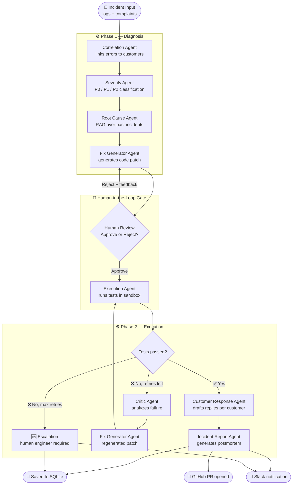

# Multi-Agent Production Incident Response System

A fully autonomous AI pipeline that detects production incidents, diagnoses the root cause, generates and validates a code fix, drafts personalized customer replies, and opens a GitHub PR — all in under 90 seconds, with a human-in-the-loop approval gate before any fix is applied.

Built with **LangGraph**, **Groq (Llama 3)**, **ChromaDB RAG**, **Streamlit**, **Slack**, and **GitHub API**.

---

## What It Does

When a production incident hits, you paste the error logs and customer complaints into the dashboard and click **Run**. The system then:

1. **Correlates** errors to complaints and identifies affected customers by name
2. **Classifies severity** (P0 Critical / P1 High / P2 Medium) based on error type, customer count, and keywords
3. **Diagnoses root cause** using RAG retrieval over a database of past incidents
4. **Generates a code patch** in a structured format with before/after diffs
5. **Pauses for human review** — you read the patch and either approve or reject with feedback
6. **Executes tests** in an isolated sandbox — if tests fail, a Critic Agent analyzes the failure and the Fix Generator retries (up to 3 times)
7. **Drafts personalized customer replies** for every affected customer
8. **Generates a postmortem report** in Markdown
9. **Sends a Slack notification** to your incident channel
10. **Opens a GitHub PR** with the fix applied to the real source file

---

## Pipeline Architecture



### Two-Phase Split

The pipeline splits into two compiled LangGraph graphs to support the human approval gate without requiring persistent checkpointers:

| Phase | Agents | Trigger |
|---|---|---|
| **Phase 1** | Correlation → Severity → Root Cause → Fix Generator | On "Run" click |
| **Phase 2** | Execution → [Critic → Fix Generator loop] → Customer Response → Incident Report | On "Approve" click |

Rejection on the approval panel calls `fix_generator_agent()` directly (no full re-run) and stays on the approval screen with the new patch.

---

## Features

- **7 specialized AI agents** orchestrated by LangGraph with a conditional retry loop
- **RAG retrieval** via ChromaDB + sentence-transformers — past incidents inform the diagnosis
- **Severity classification** (P0/P1/P2) with reasoning, shown as colored badges throughout the UI
- **Human-in-the-loop patch approval** — review before any code is executed
- **Self-healing retry loop** — Critic Agent analyzes test failures and guides regeneration (up to 3 attempts)
- **Isolated test execution** — patches run in a subprocess sandbox (Docker optional)
- **Personalized customer replies** — all customers batched into one LLM call
- **Slack notifications** — rich Block Kit messages with severity color, root cause, customers, and PR link
- **GitHub PR creation** — branch, commit, and PR opened automatically on test pass
- **SQLite incident history** — browse, filter by severity, and download postmortems
- **Analytics dashboard** — severity breakdown, MTTR trends, retry distribution, outcome matrix
- **Webhook API** (FastAPI) — external tools can POST incidents directly on port 8000
- **Streaming output** — root cause and fix explanation stream character-by-character as agents complete
- **Rate limit handling** — exponential backoff (2s → 4s → 8s → 16s) for per-minute limits; clear error for daily quota exhaustion
- **Docker support** — `docker compose up --build` starts everything with persistent volumes

---

## Tech Stack

| Layer | Technology |
|---|---|
| Agent orchestration | [LangGraph](https://github.com/langchain-ai/langgraph) |
| LLM | [Groq API](https://console.groq.com/) — `llama-3.3-70b-versatile` (or `llama-3.1-8b-instant`) |
| RAG vector store | [ChromaDB](https://www.trychroma.com/) + `sentence-transformers/all-MiniLM-L6-v2` |
| Frontend | [Streamlit](https://streamlit.io/) |
| Webhook API | [FastAPI](https://fastapi.tiangolo.com/) + [Uvicorn](https://www.uvicorn.org/) |
| Notifications | [slack-sdk](https://slack.dev/python-slack-sdk/) |
| GitHub integration | [PyGithub](https://pygithub.readthedocs.io/) |
| Analytics charts | [Plotly](https://plotly.com/python/) |
| Persistence | SQLite (stdlib `sqlite3`) |
| Testing | [pytest](https://pytest.org/) |
| Containerization | Docker + Docker Compose |

---

## Project Structure

```
├── agents/                   # One file per agent
│   ├── __init__.py           # Lazy LLM singleton with exponential backoff retry
│   ├── state.py              # IncidentState TypedDict + create_initial_state()
│   ├── correlation_agent.py  # Extracts error summary and customer names from logs
│   ├── severity_agent.py     # Classifies P0 / P1 / P2 with reasoning
│   ├── root_cause_agent.py   # RAG-augmented root cause diagnosis
│   ├── fix_generator_agent.py# Generates code patches in delimited format
│   ├── execution_agent.py    # Writes + runs test harness in subprocess/Docker
│   ├── critic_agent.py       # Analyzes test failures and guides next attempt
│   ├── customer_response_agent.py  # Drafts personalized replies (batched)
│   └── incident_report_agent.py    # Generates Markdown postmortem
│
├── graph/
│   └── workflow.py           # LangGraph graphs: phase1_app, phase2_app, app
│
├── rag/
│   ├── vectorstore.py        # ChromaDB wrapper — retrieve_context(), add_documents()
│   ├── ingestion.py          # Ingest past_incidents/*.md into ChromaDB
│   └── past_incidents/       # 4 Markdown incident knowledge-base files
│
├── app/                      # Buggy sample source files (one per test case)
│   ├── data_processing.py    # IndexError at line 42
│   ├── payment_service.py    # KeyError at line 87
│   ├── api_gateway.py        # KeyError at line 23
│   ├── notification_service.py  # AttributeError at line 78
│   ├── order_service.py      # IndexError at line 55
│   ├── analytics_service.py  # ZeroDivisionError at line 91
│   └── database_service.py   # TimeoutError at line 134
│
├── db/
│   └── history.py            # SQLite CRUD — save, list, get, delete, analytics
│
├── notifications/
│   ├── slack.py              # Block Kit Slack messages (bot token or webhook URL)
│   └── github_pr.py         # Branch, commit, and PR creation via PyGithub
│
├── api/
│   └── webhook.py            # FastAPI webhook — POST /webhook/incident
│
├── frontend/
│   ├── app.py                # Main Streamlit app (5-phase HITL state machine)
│   └── pages/
│       ├── 1_History.py      # Incident history with severity filter
│       └── 2_Analytics.py    # Charts: severity, MTTR, retry distribution
│
├── sandbox/
│   └── Dockerfile            # Isolated container for code execution
│
├── tests/
│   ├── conftest.py           # sys.path fixture
│   ├── test_agents.py        # Patch parser, router logic, RAG, execution sandbox
│   ├── test_history.py       # SQLite CRUD tests with temp DB isolation
│   ├── test_slack.py         # Block builder and transport layer tests
│   └── test_github_pr.py     # Branch naming, patch application, PR body tests
│
├── data/
│   ├── sample_logs/          # indexerror_log.txt, keyerror_log.txt, timeout_log.txt
│   └── sample_complaints/    # complaints.json
│
├── Dockerfile                # App image (python:3.11-slim, CPU torch)
├── docker-compose.yml        # Streamlit (8501) + FastAPI webhook (8000)
├── entrypoint.sh             # RAG ingestion → Streamlit start
├── requirements.txt
├── .env.example              # All environment variable documentation
└── test_cases.txt            # 7 copy-paste test scenarios for the dashboard
```

---

## Quick Start (Local)

### Prerequisites

- Python 3.11+
- [Groq API key](https://console.groq.com/) (free tier available)

### 1. Clone and install

```bash
git clone https://github.com/Raditya0902/multi-agent-production-incident-response-system.git
cd multi-agent-production-incident-response-system
pip install -r requirements.txt
```

### 2. Configure environment

```bash
cp .env.example .env
# Open .env and set GROQ_API_KEY (required)
# All other variables are optional — see Environment Variables below
```

### 3. Ingest past incidents into ChromaDB

```bash
python -m rag.ingestion
# Output: "Ingested 4 documents into ChromaDB."
```

### 4. Run the dashboard

```bash
streamlit run frontend/app.py
# Opens at http://localhost:8501
```

### 5. (Optional) Run the webhook API

```bash
uvicorn api.webhook:app --port 8000 --reload
# API docs at http://localhost:8000/docs
```

---

## Docker

Starts the Streamlit dashboard on **port 8501** and the FastAPI webhook on **port 8000**. ChromaDB and SQLite data persist across restarts in named Docker volumes.

```bash
# Build and start everything
docker compose up --build

# Stop
docker compose down

# Stop and remove volumes (clears incident history and RAG)
docker compose down -v
```

The entrypoint automatically runs `rag.ingestion` before starting Streamlit, so the RAG knowledge base is always populated.

---

## Environment Variables

Copy `.env.example` to `.env` and fill in the values you need.

| Variable | Required | Default | Description |
|---|---|---|---|
| `GROQ_API_KEY` | ✅ Yes | — | Groq API key from [console.groq.com](https://console.groq.com/) |
| `LLM_MODEL` | No | `llama-3.3-70b-versatile` | Groq model. Use `llama-3.1-8b-instant` for higher rate limits |
| `GROQ_TEMPERATURE` | No | `0.2` | LLM temperature (0–1) |
| `GROQ_MAX_TOKENS` | No | `4096` | Max tokens per LLM call |
| `MAX_RETRY_ATTEMPTS` | No | `3` | Max fix retries before escalation. Set to `1` for fast demos |
| `SANDBOX_MODE` | No | `subprocess` | `subprocess` or `docker` for test execution |
| `INCIDENT_DB_PATH` | No | `./incidents.db` | SQLite database path |
| `CHROMA_PERSIST_DIR` | No | `./rag/chroma_db` | ChromaDB persistence directory |
| `SLACK_BOT_TOKEN` | No | — | Slack bot token (`xoxb-...`). Needs `chat:write` scope |
| `SLACK_WEBHOOK_URL` | No | — | Slack incoming webhook URL (alternative to bot token) |
| `SLACK_INCIDENT_CHANNEL` | No | `#incidents` | Channel for resolved incident notifications |
| `SLACK_ESCALATION_CHANNEL` | No | Same as above | Channel for escalation alerts |
| `GITHUB_TOKEN` | No | — | GitHub PAT with `repo` scope |
| `GITHUB_REPO` | No | — | Target repo in `owner/name` format |
| `GITHUB_BASE_BRANCH` | No | `main` | Branch the PR targets |
| `WEBHOOK_API_KEY` | No | — | API key for the webhook endpoint. Empty = no auth |

---

## Running Tests

```bash
# Unit tests (no API key needed — ~8 seconds)
pytest tests/ -m "not integration" -v

# Integration test (requires GROQ_API_KEY, runs full pipeline)
pytest tests/ -m integration -v
```

**63 unit tests** cover:
- Patch parser, router logic, execution sandbox (`test_agents.py`)
- SQLite CRUD with temp DB isolation (`test_history.py`)
- Slack Block Kit builders and transport layer (`test_slack.py`)
- GitHub branch naming, patch application, PR body structure (`test_github_pr.py`)

---

## Webhook API

The FastAPI service runs on port 8000 alongside the dashboard.

### Endpoints

| Method | Path | Description |
|---|---|---|
| `GET` | `/health` | Health check |
| `POST` | `/webhook/incident` | Trigger the full pipeline |

### POST /webhook/incident

**Request body:**
```json
{
  "logs": "2024-11-15 14:32:01 ERROR [data_processing] ...\nIndexError: list index out of range",
  "complaints": [
    "App crashes every time I upload a CSV!",
    "Getting an error on file submit — urgent deadline."
  ],
  "source": "datadog"
}
```

**Response:**
```json
{
  "incident_id": 12,
  "severity": "P1",
  "status": "complete",
  "correlated_error": "IndexError in data_processing.py:42",
  "root_cause": "Missing bounds check before list indexing...",
  "tests_passed": true,
  "escalate_to_human": false,
  "affected_customers": ["Alice Johnson", "Bob Martinez"],
  "patch_explanation": "Added bounds check to handle empty batch input.",
  "run_time_seconds": 47.3,
  "slack_notified": true,
  "github_pr_url": "https://github.com/owner/repo/pull/5"
}
```

**Authentication:** set `WEBHOOK_API_KEY` in `.env` and pass it as the `X-Api-Key` request header. Leave `WEBHOOK_API_KEY` empty to disable auth in development.

Interactive API docs: `http://localhost:8000/docs`

---

## Test Cases

`test_cases.txt` contains 7 ready-to-paste scenarios for the dashboard. Each includes the exact error logs and customer complaints to paste into the two input areas.

| # | Scenario | Expected Severity | Highlights |
|---|---|---|---|
| 1 | IndexError — file upload crash | P1 | Happy path, passes on first attempt |
| 2 | KeyError — payment failure | P0 | Payment keyword triggers critical; 2 customers |
| 3 | DB timeout — connection pool | P1 | Infrastructure/performance issue |
| 4 | AttributeError — welcome email | P2 | Non-critical notification bug |
| 5 | Mass outage — service down | P0 | 5 customers, stress test |
| 6 | ZeroDivisionError — analytics | P2 | Novel error type for RAG retrieval |
| 7 | Reject → regenerate flow | P2 | Tests the human rejection + patch cycle |

Each test case corresponds to a real buggy source file in `app/` with the bug at the exact line number in the stack trace, so GitHub PRs show clean, mergeable diffs.

---

## How Each Agent Works

| Agent | Input | Output | Key design |
|---|---|---|---|
| **Correlation** | raw logs + complaints | correlated error, customer names | Strict JSON prompt; regex fallback for malformed responses |
| **Severity** | correlated error, customer count | P0 / P1 / P2 + reason | Rule hierarchy: payment/outage → P0, crash/urgent → P1, else P2 |
| **Root Cause** | correlated error, logs | root cause, relevant files | Injects top-3 ChromaDB results as numbered past-incident context |
| **Fix Generator** | root cause, files, critic feedback | code patch (delimited format) | Delimited `===FILE=== ===ORIGINAL=== ===FIXED===` avoids JSON escaping issues |
| **Execution** | code patch | test results, pass/fail | Generates synthetic pytest harness in temp dir; runs via `sys.executable` |
| **Critic** | failed test output, patch | structured feedback | Outputs `WHAT FAILED / WHY / NEXT ATTEMPT MUST` to guide regeneration |
| **Customer Response** | customer names, root cause | reply per customer | Batches all customers in one LLM call using `---CUSTOMER: name---` delimiters |
| **Incident Report** | all state fields | Markdown postmortem | Template-based for factual sections; LLM only for recommendations |

---

## Streamlit UI Pages

| Page | Path | Description |
|---|---|---|
| **Main** | `/` | 5-phase pipeline runner with live agent activity and HITL approval gate |
| **History** | `/History` | All past runs with severity filter, expandable detail tabs, and postmortem download |
| **Analytics** | `/Analytics` | Plotly charts: severity breakdown, MTTR trends, retry distribution, outcome matrix |

---

## License

MIT
